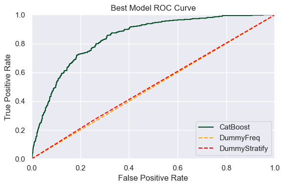
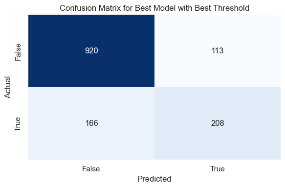

# Customer Churn Prediction with Boosting Algorithms

[Notebook](/interconnect_churn_prediction.ipynb)  
[Intro/Objective](#introobjective)  
[Data](#data)  
[Data Preprocessing](#data-preprocessing)  
[Exploratory Data Analysis](#exploratory-data-analysis)  
[Prepare Data for Modeling](#prepare-data-for-modeling)  
[Modeling](#modeling)  
[Conclusion and Recommendations](#conclusion-and-recommendations)  
[Libraries](#libraries)  

## Intro/Objective

The telecom company Interconnect would like to identify customers who are likely to discontinue their services so they can proactively reach out to them with targeted promotions and customer retention plans. The company has provided files containing information about their customers.

This project focuses on creating a predictive model to tell which customers are likely to keep or discontinue their services.  

The primary performance metric, the AUC-ROC score, will gauge the model's success in finding potential churn from loyal customers. Accuracy will be used as a secondary metric to measure the model's overall performance.

## Data

The data was pulled on February 1st, 2020 and represents Interconnect's entire customer acquisition history up to that date.

The data is split between four files that can be joined by the customerID column:

- contract.csv — information regarding each customer's contract
- personal.csv — demographic information about each customer
- internet.csv — information regarding specific internet services per customer
- phone.csv — information regarding phone services per customer

These files were combined into a single dataframe for analysis:
| #   | Column            | Non-Null Count | Dtype   |
|-----|-------------------|----------------|---------|
| 0   | CustomerID        | 7043           | object  |
| 1   | Gender            | 7043           | object  |
| 2   | SeniorCitizen     | 7043           | int64   |
| 3   | Partner           | 7043           | object  |
| 4   | Dependents        | 7043           | object  |
| 5   | BeginDate         | 7043           | object  |
| 6   | EndDate           | 7043           | object  |
| 7   | Type              | 7043           | object  |
| 8   | PaperlessBilling  | 7043           | object  |
| 9   | PaymentMethod     | 7043           | object  |
| 10  | MonthlyCharges    | 7043           | float64 |
| 11  | TotalCharges      | 7043           | object  |
| 12  | MultipleLines     | 7043           | object  |
| 13  | InternetService   | 7043           | object  |
| 14  | OnlineSecurity    | 7043           | object  |
| 15  | OnlineBackup      | 7043           | object  |
| 16  | DeviceProtection  | 7043           | object  |
| 17  | TechSupport       | 7043           | object  |
| 18  | StreamingTV       | 7043           | object  |
| 19  | StreamingMovies   | 7043           | object  |

## Data Preprocessing

Using an outer merge ensured all customers were included in the final dataset. Customer ID's not included in internet.csv and/or the phone.csv files did not have that service. These columns were filled with 'No Service' to indicate the absence of that service.

The 'BeginDate' and 'EndDate' columns were converted to periods after asserting that each record occurred on the first of the month.

'SeniorCitizen', 'Partner', 'Dependents', and 'PaperlessBilling' were all normalized to binary values.

'TotalCharges' was converted to a float after dropping the 11 records with missing values (0.16% of the data).

### Feature Engineering I

Tenure was calculated by subtracting the 'BeginDate' from the 'EndDate', replacing the na values in 'EndDate' with the date of the data pull.

The target variable, Churn, was created as 0 if the 'EndDate' was na, and 1 if the 'EndDate' was not na.

## Exploratory Data Analysis

### Target Class Balance

Class imbalance was observed in the target variable, with 73.4% of the data representing customers who did not churn. Two strategies for dealing with this were adopted:

1. Using the class_weight='balanced' parameter (or the equivalent) in the models.
2. Upsampling the minority class to match the majority class.

### Distribution of Charges and Tenure

The distribution of 'TotalCharges' and 'MonthlyCharges' were were visualized with a boxplot, histogram, and cumulative distribution plot.  

  
The 'TotalCharges' distribution was right-skewed for both groups, but with churned customers having a much higher concentration of lower values. Churned customers had lower median 'TotalCharges' than non-churned customers, but higher median 'MonthlyCharges' - mostly do to churned customers having shorter tenures. This was explored visually by plotting the distribution of tenure:  
  

Looking at charges on a monthly basis revealed that churned customers generally had higher monthly charges than non-churned customers. The histogram plot showed churned customers taking on more of a left-skewed distribution, while non-churned customers had a more normal distribution with a large peak at the lowest monthly charge.  
  

### Trend for Acquiring and Churning Customers

Interconnect began acquiring customers in October 2013, but saw a huge influx of customers in February 2014 with a steep decline to level off at about 80 customers per month. Customer acquisition began to pickup again in 2017, showing steady growth until the data pull in February 2020.  
**Note:** The company did not lose a customer until October 2019. This is likely an error in the data pulled for 'EndDate', though, the project lead has confirmed that the data is accurate. Implications of this possible error are discussed and managed throughout the project.

Splitting the groups on the timeline reveals that customers with more recent start dates churned at higher rates than in the past. If there was not an error in the data, this suggests that the company has made recent changes to their services that are not resonating with customers.

### Churn relationship to Demographic and Service data

Categorical variables were visualized to see if there was a relationship between them and the target variable. Some key observations include:

- Senior citizens have a larger share of churned customers compared to non-senior citizens.

- Customers with a Month-to-Month contract have a larger share of churned customers compared to customers with a One Year contract. Customers with a Two Year contract have the smallest share of churned customers.  

- Customers with fiber optic internet service have a larger share of churned customers compared to customers with DSL or no internet service.  
  

These features proved amongst the most important in the final model's feature importance.  

## Prepare Data for Modeling

### Feature Engineering II

BeginMonth and BeginYear were extracted from the 'BeginDate' column.

### Drop Columns

The following columns were dropped from the dataset:

- CustomerID column - unique identifier
- Drop the BeginDate column - month and year have been extracted
- Drop the BeginDateOrdinal column - redundant with BeginMonth and BeginYear
- Drop the EndDate column - this is essentially the target variable expressed as a date
- Drop the TenureMonths column - creates data leakage with the BeginMonth and BeginYear columns
- Drop the TotalCharges column - model could associate high total charges with not churning
- Drop the Gender column - Has been re-expressed in the Male column as a binary value

### Encoding

Two sets of the dataset were created for modeling: one with one-hot encoding and one without encoding for use with CatBoost.

### Train-Test Split

Both sets of the data were split into training, validation, and testing sets with a 60-20-20 split. The target variable was stratified to ensure the same class balance in each set, and the random_state was consistent between data sets to ensure the same split.

### Scaling

Scaling was not necessary since the only continuous variable was 'MonthlyCharges'.

## Modeling

Six models were considered for the task:

- A Dummy Classifier using the most frequent class as the prediction to act as a baseline.
- A Dummy Classifier using the stratified strategy to predict the class, also as a baseline.
- A Logistic Regression model with max_iter set to 1000.
- A Random Forest Classifier.
- A XGBoost Classifier, a gradient boosting algorithm.
- A CatBoost Classifier, another gradient boosting algorithm.  

### Hyperparameter Tuning and Upsampling

GridSearchCV was used to tune the hyperparameters of the Random Forest, XGBoost, and CatBoost models. A custom implementation of grid search validation was used in conjunction with the upsample function to correctly cross-validate with upsampled data.

The grid for each algorithm was as follows:  
Random Forest: {  
    n_estimators=[50, 100, 300, 500, 600, 750, 1000],  
    max_depth=[None]+list(range(1, 10))+[10, 20, 30],  
    min_samples_split=[2, 5, 10, 15, 20],  
    min_samples_leaf=[1, 2, 4]
}

XGBoost: {  
    n_estimators=[50, 100, 300, 500, 600, 750, 1000],  
    max_depth=[None]+list(range(1, 10))+[10, 20, 30],  
    min_samples_split=[2, 5, 10, 15, 20],  
    learning_rate=[0.005, 0.01, 0.05, 0.1, 0.3]  
}

CatBoost: {  
    n_estimators=[50, 100, 300, 500, 600, 750, 1000],  
    max_depth=list(range(4, 10)),  
    min_samples_split=[2, 5, 10, 15, 20],  
    learning_rate=[0.005, 0.01, 0.05, 0.1, 0.3]  
}

Tree-based models were tested on the same hyperparameters to ensure a fair comparison, with the exception of Catboost's max_depth, which was kept within the recommended range according to the [documentation](https://catboost.ai/en/docs/concepts/parameter-tuning#tree-depth).  

### Model Evaluation

Results from the hyperparameter tuning process were as follows:
|   | Model               | Dataset   | ROC_AUC  | Accuracy  |
|---|---------------------|-----------|----------|-----------|
| 0 | CatBoostClassifier   | Original  | 0.845306 | 0.731152  |
| 1 | XGBClassifier        | Original  | 0.843475 | 0.738976  |
| 2 | XGBClassifier        | Upsampled | 0.842699 | 0.770270  |
| 3 | CatBoostClassifier   | Upsampled | 0.841331 | 0.761024  |
| 4 | RandomForest         | Original  | 0.840010 | 0.774538  |
| 5 | RandomForest         | Upsampled | 0.836178 | 0.783073  |
| 6 | LogisticRegression   | Original  | 0.824327 | 0.720484  |
| 7 | LogisticRegression   | Upsampled | 0.823858 | 0.752489  |
| 8 | DummyFreq            | Original  | 0.500000 | 0.733997  |
| 9 | DummyStratify        | Original  | 0.494989 | 0.605263  |

The CatBoostClassifier with the oringal data set was the best performer. It was also noted that the best n_estimators for the CatBoost model was 1000, which was the maximum value tested. Additional hyperparameter tuning was performed for this model with n_estimators in the grid search set to [1250, 1500, 1750, 2000]. The model improved nominally with 1250 estimators. The results were added to the results table above.
|   | Model               | Dataset   | ROC_AUC  | Accuracy  |
|---|---------------------|-----------|----------|-----------|
| 0 | CatBoostClassifier   | Original  | 0.845518 | 0.738976 |

### Best Model

The best model was the CatBoostClassifier with the original data set with the parameters: {'learning_rate': 0.01, 'verbose': 0, 'auto_class_weights': 'Balanced', 'task_type': 'CPU', 'max_depth': 4, 'n_estimators': 1250, 'random_state': 42, 'cat_features': [3, 5, 7, 8, 9, 10, 11, 12, 13, 14]}.

#### Test Set Evaluation

The best model was retrained on the training and validation sets and evaluated on the test set. The model performed even better on the test set with an ROC-AUC score of 0.8555 and an accuracy of 81.31% when using the optimal threshold of 0.6969.  

The area under the ROC curve shows significant improvement over the baseline models:  
  

There is also good balance between false positives and false negatives, aligning with the business's expectations for the model:  
  

#### Feature Importance

The top ten most important features in the model were:

<table border="1" class="dataframe">
  <thead>
    <tr style="text-align: right;">
      <th></th>
      <th>ColumnIDX</th>
      <th>Feature</th>
      <th>Importance</th>
    </tr>
  </thead>
  <tbody>
    <tr>
      <th>0</th>
      <td>3</td>
      <td>Type</td>
      <td>0.046859</td>
    </tr>
    <tr>
      <th>1</th>
      <td>17</td>
      <td>BeginYear</td>
      <td>0.030858</td>
    </tr>
    <tr>
      <th>2</th>
      <td>9</td>
      <td>OnlineSecurity</td>
      <td>0.010583</td>
    </tr>
    <tr>
      <th>3</th>
      <td>8</td>
      <td>InternetService</td>
      <td>0.007578</td>
    </tr>
    <tr>
      <th>4</th>
      <td>16</td>
      <td>BeginMonth</td>
      <td>0.006498</td>
    </tr>
    <tr>
      <th>5</th>
      <td>6</td>
      <td>MonthlyCharges</td>
      <td>0.005500</td>
    </tr>
    <tr>
      <th>6</th>
      <td>12</td>
      <td>TechSupport</td>
      <td>0.003787</td>
    </tr>
    <tr>
      <th>7</th>
      <td>4</td>
      <td>PaperlessBilling</td>
      <td>0.002202</td>
    </tr>
    <tr>
      <th>8</th>
      <td>5</td>
      <td>PaymentMethod</td>
      <td>0.002188</td>
    </tr>
    <tr>
      <th>9</th>
      <td>10</td>
      <td>OnlineBackup</td>
      <td>0.001765</td>
    </tr>
  </tbody>
</table>

The second most important feature is the Begin year, but given the earlier insight that there were no churned customers until mid 2019, and that the distribution of churned customers is heavily weighted towards more recent years, I was not convinced that the data for the target variable was pulled correctly. It appears as if the data for churned customers was only pulled from 2019 forward. If that is the case, then the Begin year would cause data leakage and should be removed from the training features.

**Note:** The representation of some churned customers with a BEGIN date before 2019 is because some customers very well could have signed up before 2019, but churned in 2019. One would suspect for the distribution of churned customers to be more evenly spread out across the years if the data was pulled correctly.  

For good measure, the best model was retrained with the BeginYear column removed to see how the model performs without it.

<!-- Next Image -->

  
 

The model performed only slightly worse without the Begin year feature, but was still a strong performer with a ROC_AUC score of 84.17% and an accuracy score of 80.17%.  The feature importance for the model trained without the Begin year:

<table border="1" class="dataframe">
  <thead>
    <tr style="text-align: right;">
      <th></th>
      <th>ColumnIDX</th>
      <th>Feature</th>
      <th>Importance</th>
    </tr>
  </thead>
  <tbody>
    <tr>
      <th>0</th>
      <td>3</td>
      <td>Type</td>
      <td>0.063782</td>
    </tr>
    <tr>
      <th>1</th>
      <td>8</td>
      <td>InternetService</td>
      <td>0.012192</td>
    </tr>
    <tr>
      <th>2</th>
      <td>16</td>
      <td>BeginMonth</td>
      <td>0.011973</td>
    </tr>
    <tr>
      <th>3</th>
      <td>9</td>
      <td>OnlineSecurity</td>
      <td>0.010981</td>
    </tr>
    <tr>
      <th>4</th>
      <td>5</td>
      <td>PaymentMethod</td>
      <td>0.005004</td>
    </tr>
    <tr>
      <th>5</th>
      <td>12</td>
      <td>TechSupport</td>
      <td>0.004033</td>
    </tr>
    <tr>
      <th>6</th>
      <td>6</td>
      <td>MonthlyCharges</td>
      <td>0.003636</td>
    </tr>
    <tr>
      <th>7</th>
      <td>10</td>
      <td>OnlineBackup</td>
      <td>0.003077</td>
    </tr>
    <tr>
      <th>8</th>
      <td>4</td>
      <td>PaperlessBilling</td>
      <td>0.002314</td>
    </tr>
    <tr>
      <th>9</th>
      <td>1</td>
      <td>Partner</td>
      <td>0.001605</td>
    </tr>
  </tbody>
</table>

The most important feature is the (contract) type in both instances (but much more so when begin year is dropped from the features). This coincides with our findings in the EDA where we saw that month to month contracts churn the most and two year contracts churn the least.  

Internet service type is also a strong feature, we noted in EDA that fiber optic customers churn the most. This suggest that customers may be dissatisfied with the fiber optic service.  

Begin month also looks to be a strong feature, suggesting some seasonal relationship with churn.

## Conclusion and Recommendations

Given the similar performance of the model with and without the begin year feature, and the project lead's assurance that the data is correct, this model, trained with the begin year as part of the features, looks to be a strong candidate for deployment.  

If the model begins to underperform, I would recommend triple checking the data for the target variable to ensure that it is being pulled correctly. The company could also retrain the model with the Begin year feature removed to see if the model's in production performance improves.  

## Libraries

Python=3.10.9

numpy=1.25.2  
pandas=2.0.3  
matplotlib=3.7.1  
seaborn=0.13.1  
tqdm=4.66.2  
sklearn=1.2.2  
xgboost=1.5.1  
catboost=1.0.5  
